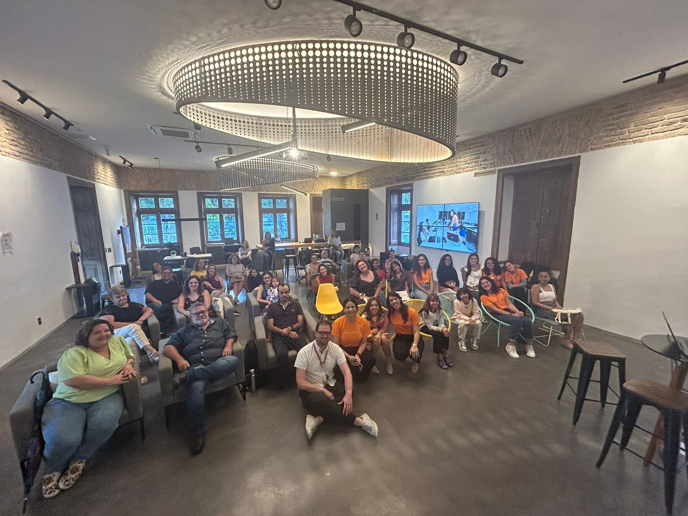
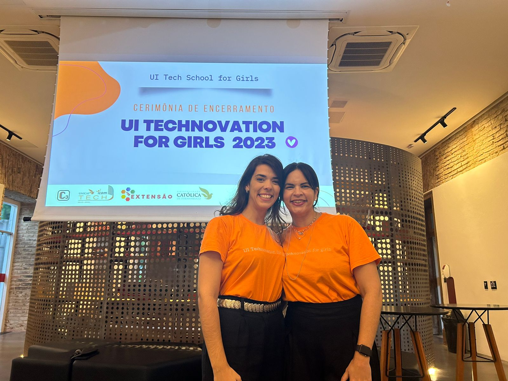

<h3 align="justify">
    O curso de Ciência da Computação promoveu uma tarde de celebração nesta sexta-feira (05/05/2023) para marcar o final de mais uma edição do projeto de extensão Technovation For Girls 2023. As famílias das participantes foram até o Pavilhão Maker para assistir às apresentações dos trabalhos desenvolvidos ao longo dos últimos meses. 
     </h3> 

    A iniciativa envolve professoras, alunas, crianças e adolescentes que utilizam os laboratórios da Unicap para criar aplicativos voltados para os objetivos de desenvolvimento sustentável estabelecidos pela Organização das Nações Unidas. Os melhores são selecionados para participar das etapas nacional e internacional do desafio Technovation Girls. 

    A embaixadora do evento no Brasil, Alice Rodrigues, falou sobre os impactos do projeto em Pernambuco, no Brasil e no mundo, além de números e equipes que venceram em edições anteriores. O Pró-reitor Comunitário e de Extensão, Padre Delmar Cardoso, esteve presente no evento. 

    Ao longo da tarde, as três equipes apresentaram seus trabalhos e soluções propostas. São os chamados pitches. Cada uma das participantes recebeu certificados. Entre elas estava Cecília, que completou 9 anos durante as atividades. Seus pais, os servidores públicos Rayanna Lira e Marcelo Lima, estavam orgulhosos. 
     
 

 
    Entre outros temas, as equipes trabalharam em aplicativos para resolver problemas na área de Meio Ambiente e bullying. Toda a mentoria foi de alunas dos cursos de tecnologia da Unicap, Ciência da Computação e Sistemas para Internet sob a supervisão de professoras da Católica. Um dos principais objetivos do projeto é o de estimular a presença das mulheres, desde criança, no campo da tecnologia. 
 